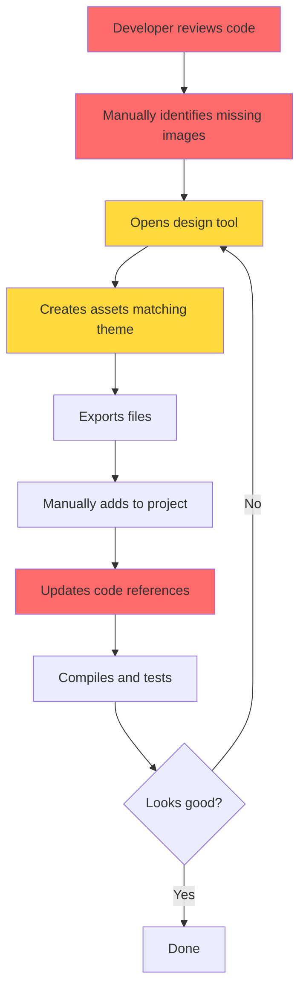
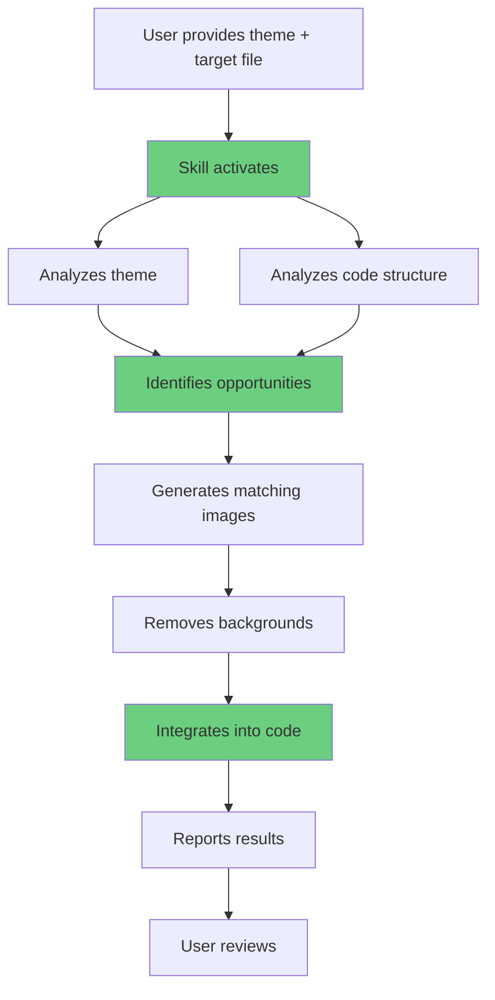
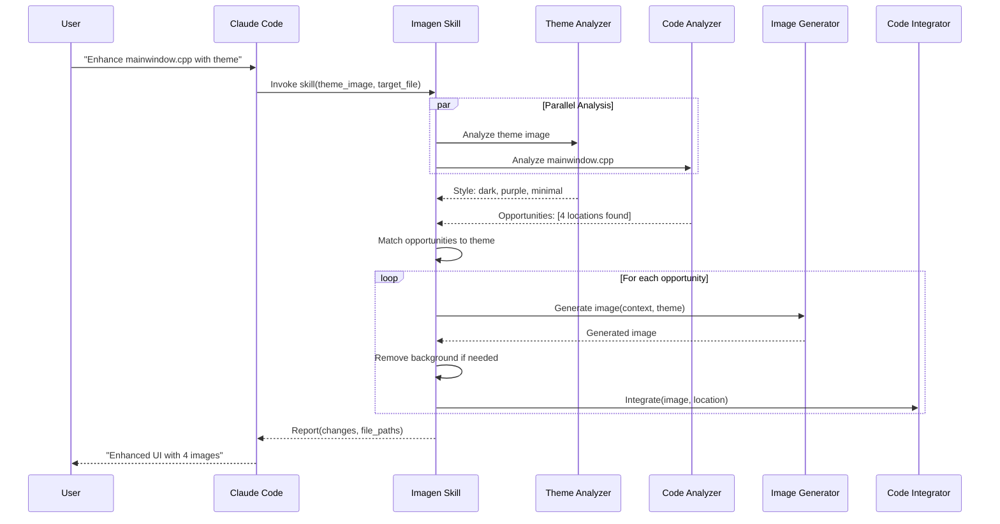
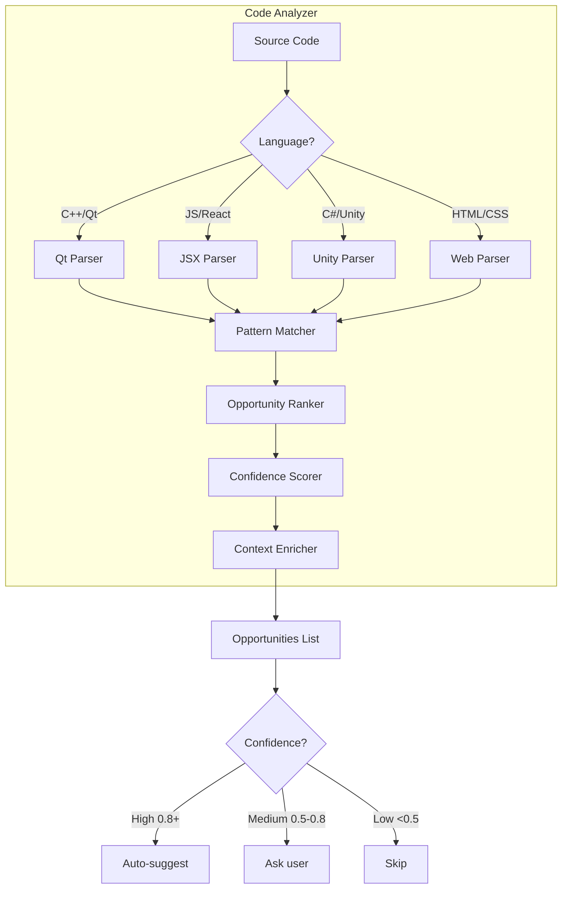
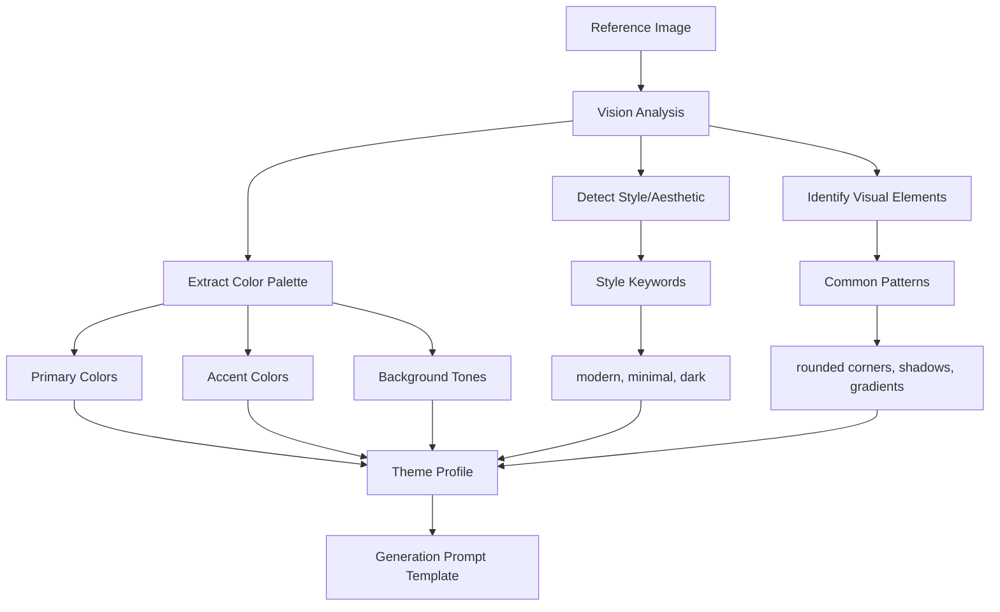
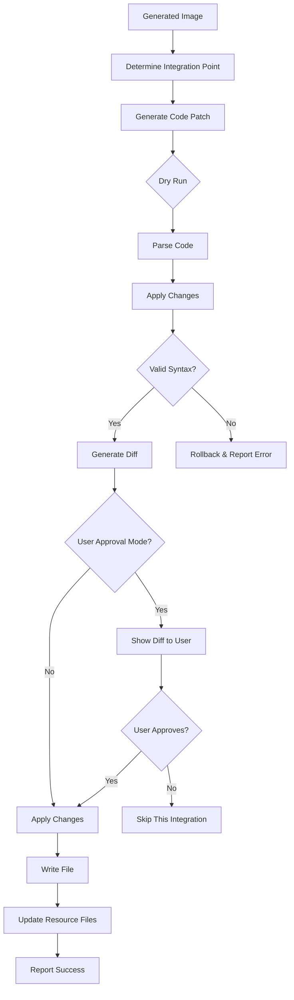
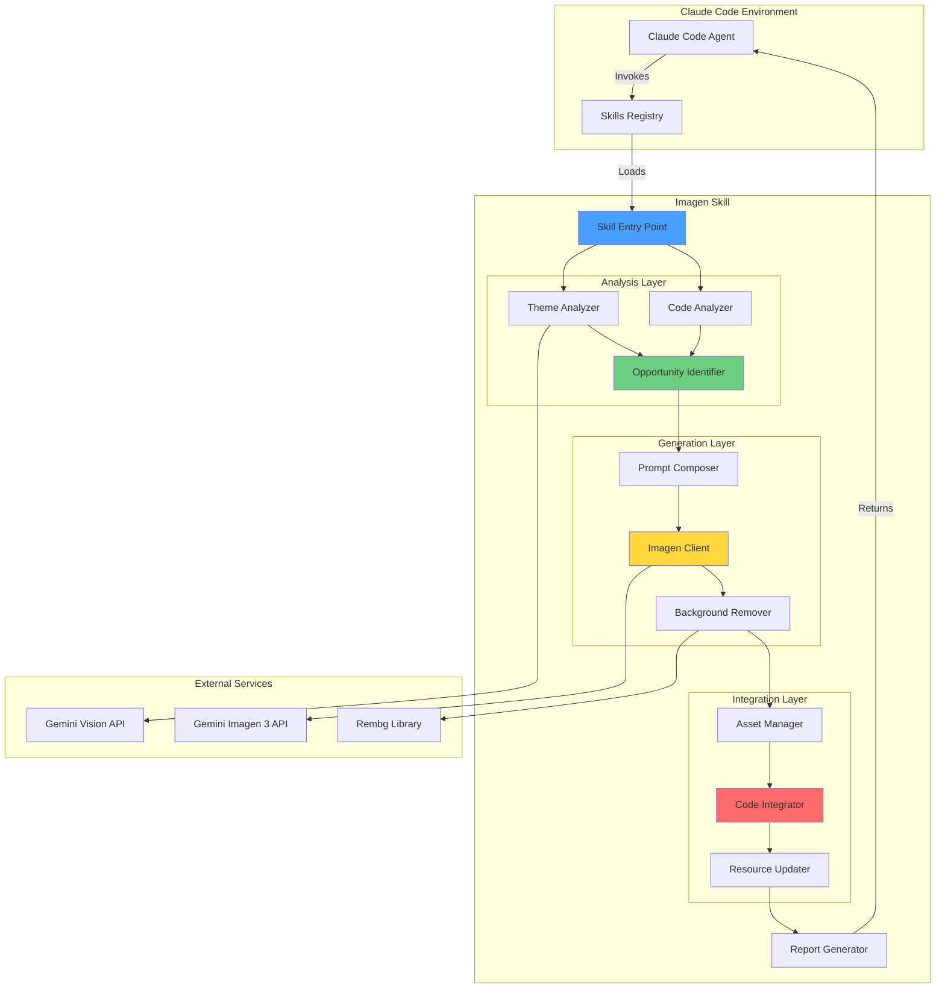

# Claude Code Imagen Skill - Product Requirements Document v2
## Autonomous UI Enhancement Agent

## Executive Summary

### Problem Statement
Developers working on UI-heavy applications (desktop apps, games, web apps) face significant friction when enhancing visual polish:
- **Manual identification** of where images would improve the UI
- **Time-consuming design work** to create matching assets
- **Context switching** between code, design tools, and asset management
- **Inconsistent theming** across generated assets
- **Manual integration** of assets into code after creation

This results in developers either:
1. Shipping UIs with placeholder images or no visual polish
2. Spending excessive time on asset creation instead of core functionality
3. Hiring designers for simple asset needs

### Solution Overview
An **autonomous Claude Code Skill** that acts as an AI design assistant, capable of:

1. **Analyzing existing code** (C++, JavaScript, Python, etc.) to identify UI enhancement opportunities
2. **Understanding visual themes** from reference images or descriptions
3. **Generating contextual images** using Gemini Imagen 3 API that match the theme
4. **Automatically removing backgrounds** for transparent assets
5. **Implementing generated assets** directly into the codebase
6. **Operating autonomously** when invoked by Claude Code's main agent

### Key Workflow
```
User → Claude Code: "Here's my theme [image]. Review mainwindow.cpp and add images"
Claude Code → Imagen Skill: Invokes with context
Imagen Skill → Autonomous execution:
  1. Analyzes theme image for style/colors
  2. Reads and parses mainwindow.cpp
  3. Identifies UI improvement opportunities
  4. Generates appropriate images
  5. Removes backgrounds
  6. Integrates into code
  7. Reports results
User → Reviews changes and iterates if needed
```

### Success Metrics
- **Autonomous Accuracy**: 85%+ of suggested locations are appropriate
- **Theme Consistency**: 90%+ of generated images match provided theme
- **Integration Quality**: 95%+ of code integrations compile without errors
- **Time Savings**: 20x faster than manual design workflow
- **User Satisfaction**: 4.5/5 rating for autonomous suggestions

---

## Problem & Solution Deep Dive

### Current State: Manual UI Enhancement


**Time Investment**: 30-60 minutes per UI component

### Proposed State: Autonomous Enhancement


**Time Investment**: 2-5 minutes (mostly waiting for generation)

---

## User Stories & Scenarios

### Epic 1: Theme-Aware Autonomous Enhancement

#### Story 1.1: Enhance Qt C++ Application
**As a** C++ desktop developer
**I want** Claude Code to analyze my UI code and add themed images autonomously
**So that** I can quickly polish my application without manual design work

**User Interaction:**
```
User: "I've attached a screenshot of my app's theme. Review mainwindow.cpp
      and look for opportunities to add images to improve the UI. Use the
      imagen skill to generate the images. After generation, implement them
      in the appropriate places."

Claude Code: [Invokes Imagen Skill with context]

Skill Output:
  ✓ Analyzed theme: Dark mode, purple accent, modern minimal style
  ✓ Analyzed mainwindow.cpp (Qt framework detected)
  ✓ Found 4 enhancement opportunities:
    1. Header logo area (line 45) - Generated: logo.png
    2. Empty sidebar icons (lines 120-125) - Generated: 5 icons
    3. Placeholder image in dashboard (line 200) - Generated: hero.png
    4. Button backgrounds (lines 150-160) - Generated: 3 button states
  ✓ All images implemented and code updated
  ✓ Images saved to: ./resources/ui/

User: [Reviews changes, provides feedback if needed]
```

**Acceptance Criteria:**
- [ ] Skill can read and parse C++ Qt code
- [ ] Identifies appropriate locations for images (headers, buttons, icons, backgrounds)
- [ ] Analyzes theme image for style, colors, and aesthetic
- [ ] Generates images that match the theme
- [ ] Updates C++ code with proper resource paths
- [ ] Creates/updates Qt resource files (.qrc) if needed
- [ ] Handles multiple frameworks (Qt, GTK, wxWidgets)

**Primary Flow:**


**Edge Cases:**
- Theme image is unclear → Ask user for clarification or use defaults
- No opportunities found → Explain why and suggest alternatives
- Code structure is ambiguous → Present options to user
- Generation fails → Retry or skip that opportunity
- Code integration would break compilation → Show proposed change without applying

---

#### Story 1.2: Enhance Web Application
**As a** web developer
**I want** the skill to enhance my React components with themed images
**So that** I can improve visual appeal without leaving my workflow

**User Interaction:**
```
User: "My design system uses these colors [attached palette]. Review
      src/components/Dashboard.tsx and add appropriate images."

Skill Output:
  ✓ Analyzed color palette: Brand colors extracted
  ✓ Analyzed Dashboard.tsx (React + TypeScript)
  ✓ Enhanced 3 areas:
    1. Empty state illustration - Generated: empty-state.png
    2. Feature cards missing icons - Generated: 6 icons
    3. Hero section background - Generated: abstract-bg.png
  ✓ Updated import statements
  ✓ Updated JSX with image references
  ✓ Created: src/assets/dashboard/
```

**Acceptance Criteria:**
- [ ] Extracts color palette from reference images
- [ ] Parses React/JSX code structure
- [ ] Identifies empty states, missing icons, background opportunities
- [ ] Generates images using brand colors
- [ ] Updates import statements
- [ ] Updates JSX with proper image tags
- [ ] Handles TypeScript types for image imports

---

#### Story 1.3: Enhance Game UI
**As a** game developer
**I want** the skill to generate and implement UI sprites for my game
**So that** I can quickly prototype game menus and HUDs

**User Interaction:**
```
User: "My game has a sci-fi theme with neon colors. Review GameUI.cpp
      and add button sprites, health bar icons, and menu backgrounds."

Skill Output:
  ✓ Detected theme: Sci-fi, neon blue/pink, futuristic
  ✓ Analyzed GameUI.cpp (custom game engine)
  ✓ Generated UI sprite set:
    - 3 button states (normal, hover, pressed)
    - 5 health bar icons
    - 2 menu backgrounds
  ✓ All sprites: 64x64 to 512x512, transparent backgrounds
  ✓ Updated sprite loading code
  ✓ Created sprite atlas metadata
```

**Acceptance Criteria:**
- [ ] Generates sprites in appropriate sizes
- [ ] Creates sprite states (button: normal/hover/pressed)
- [ ] Generates icon sets with consistent style
- [ ] Exports transparent PNGs
- [ ] Updates sprite loading code
- [ ] Optionally creates sprite atlas/sheet

---

### Epic 2: Intelligent Code Analysis

#### Story 2.1: Detect UI Enhancement Opportunities
**As the** Imagen Skill
**I need to** analyze code to find where images would improve the UI
**So that** I can make intelligent suggestions

**Detection Heuristics:**

```yaml
high_confidence_opportunities:
  qt_cpp:
    - QLabel with empty text and fixed size → Logo/image placeholder
    - QPushButton with setIcon(QIcon()) → Missing button icon
    - QPixmap assignments with placeholder paths → Placeholder images
    - Empty QGraphicsScene areas → Background images
    - QToolBar addAction without icons → Toolbar icons

  react_jsx:
    -  → Placeholder image
    - <div className="icon-container"></div> → Missing icon
    - Empty state components → Illustration needed
    - Hero sections with plain backgrounds → Hero image
    - Button without icons in icon button pattern → Icon needed

  html_css:
    -  tags with placeholder/default sources
    - Empty divs with "icon", "logo", "hero" classes
    - CSS: background-image: none with visual container

  unity_csharp:
    - Image component with null sprite
    - Button with null target graphic
    - UI.Image assignments to placeholder sprites

medium_confidence_opportunities:
  - Comments like "TODO: Add icon", "FIXME: Replace placeholder"
  - Empty UI containers with sizing constraints
  - Hardcoded color backgrounds that could be images
  - Repetitive visual elements that could be sprites
```

**Code Analysis Architecture:**


**Acceptance Criteria:**
- [ ] Detect framework/library from imports and syntax
- [ ] Identify UI-related code sections
- [ ] Find explicit placeholders (placeholder.png, TODO comments)
- [ ] Detect empty UI containers with sizing
- [ ] Find icon/image property assignments with null/empty values
- [ ] Score each opportunity by confidence (0.0-1.0)
- [ ] Provide context for each suggestion (line number, surrounding code)

---

#### Story 2.2: Understand Visual Context
**As the** Imagen Skill
**I need to** understand the purpose and context of each image opportunity
**So that** I generate appropriate images

**Context Analysis:**
```python
class OpportunityContext:
    location: CodeLocation
    purpose: ImagePurpose  # ICON, LOGO, BUTTON, BACKGROUND, ILLUSTRATION
    size_hint: Optional[Dimensions]  # From code: setFixedSize(64, 64)
    semantic_context: str  # Variable names, nearby text, comments
    ui_hierarchy: str  # Parent containers, siblings
    user_interaction: str  # Button, static display, animated
    confidence: float

def analyze_context(code_snippet: str, location: CodeLocation) -> OpportunityContext:
    """
    Example for Qt:
      Line: settingsButton.setIcon(QIcon());

      Context extracted:
        - purpose: ICON (from setIcon method)
        - semantic: "settings" (from variable name)
        - size_hint: toolbar size (from parent QToolBar)
        - interaction: clickable (QPushButton)
        - confidence: 0.95

    Generation prompt becomes:
      "Settings icon, gear symbol, purple accent color,
       32x32, modern minimal style, transparent background"
    """
```

**Acceptance Criteria:**
- [ ] Extract semantic meaning from variable/function names
- [ ] Infer image dimensions from code (setSize, width/height props)
- [ ] Determine image purpose (icon, background, illustration, etc.)
- [ ] Understand user interaction context (button, display, animation)
- [ ] Extract nearby text/labels for semantic context
- [ ] Build generation prompt from context

---

### Epic 3: Theme-Aware Generation

#### Story 3.1: Analyze Theme from Reference Image
**As the** Imagen Skill
**I need to** extract visual style from a reference image
**So that** generated images match the user's theme

**Theme Analysis Flow:**


**Theme Profile Structure:**
```yaml
theme_profile:
  colors:
    primary: "#7C3AED"  # Purple
    secondary: "#EC4899"  # Pink
    accent: "#F59E0B"  # Orange
    background: "#1F2937"  # Dark gray
    text: "#F9FAFB"  # Light gray

  style:
    aesthetic: "modern minimal"
    mood: "professional, tech-forward"
    keywords: ["clean", "rounded", "shadow"]

  visual_patterns:
    - "Subtle gradients"
    - "Rounded corners (8-12px)"
    - "Drop shadows"
    - "Icon style: outline/stroke"

  generation_template:
    base_prompt: "{description} icon, modern minimal style, {primary_color} accent"
    modifiers: ["transparent background", "subtle gradient", "rounded shapes"]
```

**Implementation:**
```python
def analyze_theme_image(image_path: str) -> ThemeProfile:
    """
    Use Gemini's vision capabilities to analyze theme
    """
    prompt = """
    Analyze this UI screenshot/design and extract:
    1. Color palette (primary, secondary, accent, backgrounds)
    2. Visual style (modern, retro, minimal, ornate, etc.)
    3. Common design patterns (shadows, gradients, shapes)
    4. Icon style if visible (filled, outline, flat, 3D)
    5. Overall mood and aesthetic

    Return as structured data.
    """

    response = gemini.generate_content([prompt, image_path])
    return parse_theme_profile(response.text)
```

**Acceptance Criteria:**
- [ ] Extract dominant and accent colors from reference image
- [ ] Identify visual style (modern, minimal, retro, etc.)
- [ ] Detect design patterns (shadows, gradients, shapes)
- [ ] Determine icon style if icons are visible
- [ ] Generate prompt template incorporating theme
- [ ] Handle various reference types (screenshots, mockups, color palettes)

---

#### Story 3.2: Generate Theme-Consistent Images
**As the** Imagen Skill
**I need to** generate images that match the analyzed theme
**So that** all assets feel cohesive with the existing design

**Prompt Engineering Strategy:**
```python
def build_generation_prompt(
    opportunity: OpportunityContext,
    theme: ThemeProfile
) -> str:
    """
    Combine opportunity context with theme to create optimal prompt
    """

    # Base description from context
    description = opportunity.semantic_context  # "settings"
    purpose = opportunity.purpose  # ICON

    # Apply theme styling
    style = theme.style.aesthetic  # "modern minimal"
    colors = theme.colors.primary  # "#7C3AED"
    patterns = theme.visual_patterns  # ["rounded", "shadow"]

    # Size optimization
    size = opportunity.size_hint or default_size_for(purpose)

    # Build prompt
    prompt = f"""
    {description} {purpose.value.lower()},
    {style} style,
    using {colors} as primary color,
    {' '.join(patterns)},
    {size} dimensions,
    transparent background,
    high quality
    """

    return prompt.strip()

# Example outputs:
# "Settings icon, modern minimal style, purple (#7C3AED) accent,
#  rounded shapes with subtle shadow, 32x32, transparent background"

# "Hero background image, modern minimal style, dark gradient from
#  #1F2937 to #7C3AED, abstract geometric shapes, 1920x1080"
```

**Generation Parameters:**
```yaml
imagen_config:
  model: "imagen-3.0-generate-002"

  by_purpose:
    ICON:
      aspect_ratio: "1:1"
      style_weight: 0.8  # Strong style adherence
      background: solid_color  # For easy removal

    LOGO:
      aspect_ratio: "1:1" or "4:3"
      style_weight: 0.9
      background: solid_color

    BUTTON:
      aspect_ratio: based_on_size_hint
      style_weight: 0.7
      variations: 3  # normal, hover, pressed

    HERO:
      aspect_ratio: "16:9" or "21:9"
      style_weight: 0.6  # More creative freedom
      background: keep  # Usually want background

    ILLUSTRATION:
      aspect_ratio: based_on_container
      style_weight: 0.7
      background: solid_color
```

**Acceptance Criteria:**
- [ ] Build prompts that incorporate theme colors
- [ ] Apply theme style keywords to generations
- [ ] Use appropriate aspect ratios for each purpose
- [ ] Generate variations for stateful UI (button states)
- [ ] Maintain consistency across multiple generations
- [ ] Handle edge cases (no theme provided → use defaults)

---

### Epic 4: Autonomous Code Integration

#### Story 4.1: Implement Generated Images in Code
**As the** Imagen Skill
**I need to** automatically update code with generated image references
**So that** users don't need to manually integrate assets

**Integration Strategy by Framework:**

```yaml
qt_cpp:
  icon_integration:
    pattern: 'button.setIcon(QIcon());'
    replacement: 'button.setIcon(QIcon(":/resources/icons/settings.png"));'
    additional:
      - Update .qrc resource file
      - Add to resources section

  pixmap_integration:
    pattern: 'QPixmap pixmap;'
    replacement: 'QPixmap pixmap(":/resources/images/logo.png");'

react_jsx:
  import_integration:
    pattern: '// TODO: Add imports'
    replacement: "import settingsIcon from '../assets/icons/settings.png';"

  jsx_integration:
    pattern: '<div className="icon-container"></div>'
    replacement: '<div className="icon-container"></div>'

html_css:
  img_tag:
    pattern: ''
    replacement: ''

  css_background:
    pattern: 'background-image: none;'
    replacement: 'background-image: url("./assets/images/background.png");'

unity_csharp:
  sprite_integration:
    pattern: 'public Sprite icon;'
    replacement: 'public Sprite icon;  // Set in Inspector: icons/settings'
    additional:
      - Copy image to Assets/Resources/
      - Import settings for sprites
```

**Safe Integration Architecture:**


**Acceptance Criteria:**
- [ ] Update code at identified locations
- [ ] Maintain code formatting and style
- [ ] Validate syntax after changes
- [ ] Update resource/config files (Qt .qrc, package.json, etc.)
- [ ] Generate diffs for user review
- [ ] Rollback on errors
- [ ] Handle multiple integrations in same file
- [ ] Support various file encodings

---

#### Story 4.2: Manage Generated Assets
**As the** Imagen Skill
**I need to** organize generated assets in appropriate directories
**So that** projects stay organized

**Asset Organization Strategy:**
```python
def determine_asset_location(
    project_root: str,
    framework: Framework,
    image_type: ImagePurpose
) -> str:
    """
    Determine appropriate save location based on project structure
    """

    conventions = {
        Framework.QT: {
            ImagePurpose.ICON: "resources/icons/",
            ImagePurpose.LOGO: "resources/images/",
            ImagePurpose.BUTTON: "resources/ui/buttons/",
            ImagePurpose.BACKGROUND: "resources/images/backgrounds/"
        },
        Framework.REACT: {
            ImagePurpose.ICON: "src/assets/icons/",
            ImagePurpose.LOGO: "src/assets/images/",
            ImagePurpose.ILLUSTRATION: "src/assets/illustrations/"
        },
        Framework.UNITY: {
            ImagePurpose.ICON: "Assets/Resources/UI/Icons/",
            ImagePurpose.SPRITE: "Assets/Resources/Sprites/"
        }
    }

    # Check if conventional directories exist
    convention_path = conventions[framework][image_type]
    full_path = os.path.join(project_root, convention_path)

    if not os.path.exists(full_path):
        # Look for similar existing directories
        alt_path = find_similar_directory(project_root, image_type)
        if alt_path:
            return alt_path

        # Ask user or create conventional directory
        if auto_create_enabled:
            os.makedirs(full_path, exist_ok=True)
            return full_path

    return full_path
```

**Metadata Tracking:**
```json
{
  "generated_images": [
    {
      "id": "img_20251101_001",
      "file_path": "resources/icons/settings.png",
      "purpose": "icon",
      "semantic": "settings",
      "generated_at": "2025-11-01T10:30:00Z",
      "theme_profile_id": "theme_001",
      "generation_prompt": "Settings icon, modern minimal style, purple accent...",
      "integrated_locations": [
        {
          "file": "mainwindow.cpp",
          "line": 45,
          "type": "QIcon assignment"
        }
      ],
      "dimensions": "32x32",
      "cost": 0.03
    }
  ],
  "theme_profiles": [
    {
      "id": "theme_001",
      "source_image": "reference_theme.png",
      "colors": {...},
      "style": {...}
    }
  ]
}
```

**Acceptance Criteria:**
- [ ] Detect project structure and follow conventions
- [ ] Create directories if they don't exist
- [ ] Use semantic naming (settings-icon.png, not image-1.png)
- [ ] Track metadata for each generated image
- [ ] Link images to their integration points
- [ ] Support rollback/regeneration

---

### Epic 5: Skill Invocation & Reporting

#### Story 5.1: Skill Activation by Claude Code
**As** Claude Code's main agent
**I want to** invoke the Imagen Skill when users request UI enhancement
**So that** the skill can operate autonomously

**Invocation Pattern:**
```
User message to Claude Code:
  "I've attached my app's theme. Review mainwindow.cpp and add images to improve the UI"

Claude Code recognizes:
  - User wants UI enhancement
  - Has provided reference material (theme)
  - Has specified target file (mainwindow.cpp)
  - Wants autonomous operation ("add images")

Claude Code invokes skill:
  Skill: imagen-ui-enhance
  Parameters:
    - theme_reference: <attached_image>
    - target_files: ["mainwindow.cpp"]
    - mode: autonomous
    - approval_required: false
```

**Skill Interface:**
```python
class ImagenUIEnhanceSkill:
    def execute(
        self,
        target_files: List[str],
        theme_reference: Optional[str] = None,
        theme_description: Optional[str] = None,
        mode: Literal["autonomous", "interactive"] = "autonomous",
        approval_required: bool = False,
        max_cost: float = 0.50
    ) -> SkillResult:
        """
        Main entry point when Claude Code invokes the skill

        Args:
            target_files: Code files to analyze
            theme_reference: Path to reference image
            theme_description: Text description of theme
            mode: How to operate
            approval_required: Whether to ask before each change
            max_cost: Budget limit for API calls

        Returns:
            SkillResult with changes made, images generated, costs
        """
        pass
```

**Acceptance Criteria:**
- [ ] Can be invoked programmatically by Claude Code
- [ ] Accepts files and theme references
- [ ] Supports autonomous and interactive modes
- [ ] Respects cost limits
- [ ] Returns structured results

---

#### Story 5.2: Progress Reporting
**As the** Imagen Skill
**I need to** report progress during execution
**So that** users understand what's happening

**Progress Events:**
```python
@dataclass
class SkillProgress:
    stage: str  # "analyzing", "generating", "integrating", "complete"
    message: str
    progress: float  # 0.0 to 1.0
    details: Dict[str, Any]

# Example progress stream:
[
  SkillProgress(
    stage="analyzing",
    message="Analyzing theme from reference image...",
    progress=0.1,
    details={"theme_file": "theme.png"}
  ),
  SkillProgress(
    stage="analyzing",
    message="Analyzing mainwindow.cpp structure...",
    progress=0.2,
    details={"framework": "Qt", "lines": 450}
  ),
  SkillProgress(
    stage="analyzing",
    message="Found 4 enhancement opportunities",
    progress=0.3,
    details={"opportunities": 4, "high_confidence": 3, "medium": 1}
  ),
  SkillProgress(
    stage="generating",
    message="Generating settings icon (1/4)...",
    progress=0.4,
    details={"current": 1, "total": 4}
  ),
  # ... more progress events ...
  SkillProgress(
    stage="complete",
    message="Enhanced UI with 4 images",
    progress=1.0,
    details={
      "images_generated": 4,
      "integrations": 4,
      "total_cost": 0.12,
      "files_modified": ["mainwindow.cpp", "resources.qrc"]
    }
  )
]
```

**Final Report Format:**
```markdown
# UI Enhancement Complete

## Summary
✓ Analyzed theme: Dark mode with purple accents, modern minimal style
✓ Analyzed mainwindow.cpp (Qt framework, 450 lines)
✓ Found 4 enhancement opportunities

## Generated Images
1. **Settings Icon** (32x32)
   - Location: resources/icons/settings.png
   - Integrated at: mainwindow.cpp:45
   - Purpose: Toolbar button icon

2. **Profile Icon** (32x32)
   - Location: resources/icons/profile.png
   - Integrated at: mainwindow.cpp:48

3. **Logo** (128x64)
   - Location: resources/images/logo.png
   - Integrated at: mainwindow.cpp:120
   - Purpose: Header branding

4. **Dashboard Background** (800x600)
   - Location: resources/images/dashboard-bg.png
   - Integrated at: mainwindow.cpp:200
   - Purpose: Dashboard panel background

## Files Modified
- mainwindow.cpp (4 changes)
- resources.qrc (4 new entries)

## Cost Summary
- Images generated: 4
- Total API cost: $0.12
- Time saved: ~45 minutes

## Next Steps
- Review the changes in your IDE
- Run your build to verify compilation
- Test the UI to ensure images look correct
- Run `/imagen-refine <image-name>` if any need adjustment
```

**Acceptance Criteria:**
- [ ] Provide real-time progress updates
- [ ] Generate comprehensive final report
- [ ] Include file paths and line numbers
- [ ] Show cost breakdown
- [ ] Suggest next steps
- [ ] Format for terminal readability

---

## Technical Architecture

### System Overview


### Component Breakdown

#### 1. Skill Entry Point
```markdown
**File**: `imagen_skill.py`
**Purpose**: Main skill interface invoked by Claude Code
**Responsibilities**:
- Accept invocation parameters
- Validate inputs
- Orchestrate analysis → generation → integration pipeline
- Report progress
- Return results
```

**Interface:**
```python
class ImagenSkill:
    """
    Autonomous UI enhancement skill for Claude Code
    """

    def __init__(self, config: SkillConfig):
        self.theme_analyzer = ThemeAnalyzer()
        self.code_analyzer = CodeAnalyzer()
        self.image_generator = ImageGenerator()
        self.code_integrator = CodeIntegrator()
        self.asset_manager = AssetManager()

    async def execute(
        self,
        target_files: List[str],
        theme_reference: Optional[str] = None,
        project_root: str = ".",
        **kwargs
    ) -> SkillResult:
        """Main execution method"""

        # Phase 1: Analysis
        theme = await self.analyze_theme(theme_reference)
        opportunities = await self.analyze_code(target_files, project_root)

        # Phase 2: Generation
        images = await self.generate_images(opportunities, theme)

        # Phase 3: Integration
        results = await self.integrate_images(images, opportunities)

        # Phase 4: Report
        return self.generate_report(results)
```

#### 2. Theme Analyzer
```markdown
**File**: `theme_analyzer.py`
**Purpose**: Extract visual theme from reference images
**Responsibilities**:
- Analyze reference images with Gemini Vision
- Extract color palettes
- Identify visual style and patterns
- Generate theme profile for image generation
```

**Implementation:**
```python
class ThemeAnalyzer:
    def __init__(self):
        self.vision_model = genai.GenerativeModel('gemini-1.5-pro')

    async def analyze(self, image_path: str) -> ThemeProfile:
        """
        Analyze visual theme from reference image
        """

        prompt = """
        Analyze this UI design/screenshot and extract:

        1. **Color Palette**:
           - Primary color (hex)
           - Secondary colors (hex)
           - Accent colors (hex)
           - Background tones (hex)

        2. **Visual Style**:
           - Aesthetic keywords (modern, minimal, retro, etc.)
           - Mood (professional, playful, serious, etc.)
           - Design patterns (shadows, gradients, flat, etc.)

        3. **UI Elements**:
           - Icon style (filled, outline, flat, 3D)
           - Button style (rounded, sharp, pill-shaped)
           - Typography weight (light, regular, bold)

        4. **Technical Details**:
           - Border radius typically used
           - Shadow intensity
           - Spacing patterns

        Return as JSON.
        """

        image = Image.open(image_path)
        response = await self.vision_model.generate_content([prompt, image])

        theme_data = json.loads(response.text)
        return ThemeProfile.from_dict(theme_data)
```

#### 3. Code Analyzer
```markdown
**File**: `code_analyzer.py`
**Purpose**: Analyze code to find UI enhancement opportunities
**Responsibilities**:
- Detect framework/language
- Parse code structure
- Identify image placeholder locations
- Score opportunities by confidence
- Extract context for each opportunity
```

**Implementation:**
```python
class CodeAnalyzer:
    def __init__(self):
        self.parsers = {
            'qt': QtCodeParser(),
            'react': ReactCodeParser(),
            'unity': UnityCodeParser(),
            'html': HTMLCodeParser()
        }

    async def analyze(
        self,
        file_paths: List[str],
        project_root: str
    ) -> List[Opportunity]:
        """
        Analyze code files for image opportunities
        """

        opportunities = []

        for file_path in file_paths:
            # Detect framework
            framework = self.detect_framework(file_path)
            parser = self.parsers.get(framework)

            if not parser:
                continue

            # Parse file
            code = read_file(file_path)
            ast = parser.parse(code)

            # Find opportunities
            file_opportunities = parser.find_opportunities(ast, code)

            # Enrich with context
            for opp in file_opportunities:
                opp.context = parser.extract_context(ast, opp.location)
                opp.confidence = self.score_confidence(opp)

            opportunities.extend(file_opportunities)

        # Rank by confidence
        opportunities.sort(key=lambda o: o.confidence, reverse=True)

        return opportunities

class QtCodeParser:
    """Parser for Qt C++ code"""

    def find_opportunities(self, ast, code: str) -> List[Opportunity]:
        opportunities = []

        # Pattern: button.setIcon(QIcon())
        for match in re.finditer(r'(\w+)\.setIcon\(QIcon\(\)\)', code):
            var_name = match.group(1)
            line_num = code[:match.start()].count('\n') + 1

            opportunities.append(Opportunity(
                file_path=self.current_file,
                line_number=line_num,
                purpose=ImagePurpose.ICON,
                semantic_context=self.extract_semantic(var_name),
                code_snippet=match.group(0),
                integration_type=IntegrationType.QT_ICON
            ))

        # Pattern: QPixmap with empty/placeholder
        # Pattern: QLabel with size hint but no pixmap
        # ... more patterns ...

        return opportunities
```

#### 4. Image Generator
```markdown
**File**: `image_generator.py`
**Purpose**: Generate images using Imagen API
**Responsibilities**:
- Build generation prompts from context + theme
- Call Imagen API
- Remove backgrounds
- Optimize file sizes
- Save images to appropriate locations
```

**Implementation:**
```python
class ImageGenerator:
    def __init__(self):
        self.imagen_client = ImagenClient()
        self.background_remover = BackgroundRemover()

    async def generate(
        self,
        opportunity: Opportunity,
        theme: ThemeProfile
    ) -> GeneratedImage:
        """
        Generate image for specific opportunity
        """

        # Build prompt
        prompt = self.build_prompt(opportunity, theme)

        # Determine parameters
        params = self.get_generation_params(opportunity)

        # Generate
        image_bytes = await self.imagen_client.generate(
            prompt=prompt,
            aspect_ratio=params.aspect_ratio,
            style_weight=params.style_weight
        )

        # Remove background if needed
        if opportunity.purpose in [ImagePurpose.ICON, ImagePurpose.LOGO]:
            image_bytes = await self.background_remover.remove(image_bytes)

        # Save
        file_path = self.determine_save_path(opportunity)
        save_image(file_path, image_bytes)

        return GeneratedImage(
            opportunity=opportunity,
            file_path=file_path,
            prompt=prompt,
            theme_profile=theme,
            metadata=ImageMetadata(...)
        )

    def build_prompt(
        self,
        opportunity: Opportunity,
        theme: ThemeProfile
    ) -> str:
        """
        Build Imagen prompt from context + theme
        """

        # Base description from semantic context
        description = opportunity.semantic_context  # "settings"

        # Purpose-specific wording
        purpose_map = {
            ImagePurpose.ICON: f"{description} icon",
            ImagePurpose.LOGO: f"{description} logo",
            ImagePurpose.BUTTON: f"{description} button",
            ImagePurpose.BACKGROUND: f"{description} background pattern"
        }
        base = purpose_map[opportunity.purpose]

        # Apply theme
        style = theme.style.aesthetic  # "modern minimal"
        primary_color = theme.colors.primary  # "#7C3AED"

        # Build full prompt
        prompt = f"""
        {base}, {style} style,
        using {primary_color} as primary color,
        {', '.join(theme.style.keywords)},
        high quality, professional design
        """

        # Add background requirement for icons/logos
        if opportunity.purpose in [ImagePurpose.ICON, ImagePurpose.LOGO]:
            prompt += ", on solid white background for easy removal"

        return prompt.strip()
```

#### 5. Code Integrator
```markdown
**File**: `code_integrator.py`
**Purpose**: Integrate generated images into code
**Responsibilities**:
- Update code at identified locations
- Maintain code style and formatting
- Update resource files (Qt .qrc, etc.)
- Validate changes don't break syntax
- Generate diffs for review
```

**Implementation:**
```python
class CodeIntegrator:
    def __init__(self):
        self.integrators = {
            IntegrationType.QT_ICON: QtIconIntegrator(),
            IntegrationType.QT_PIXMAP: QtPixmapIntegrator(),
            IntegrationType.REACT_IMPORT: ReactImportIntegrator(),
            IntegrationType.REACT_JSX: ReactJSXIntegrator()
        }

    async def integrate(
        self,
        generated_image: GeneratedImage,
        dry_run: bool = False
    ) -> IntegrationResult:
        """
        Integrate generated image into code
        """

        opportunity = generated_image.opportunity
        integrator = self.integrators[opportunity.integration_type]

        # Read current code
        code = read_file(opportunity.file_path)

        # Generate updated code
        updated_code = integrator.integrate(
            code=code,
            opportunity=opportunity,
            image_path=generated_image.file_path
        )

        # Validate syntax
        if not self.validate_syntax(updated_code, opportunity.file_path):
            raise IntegrationError("Generated code has syntax errors")

        # Generate diff
        diff = generate_diff(code, updated_code)

        if dry_run:
            return IntegrationResult(
                success=True,
                diff=diff,
                applied=False
            )

        # Apply changes
        write_file(opportunity.file_path, updated_code)

        # Update resource files if needed
        if opportunity.requires_resource_update:
            self.update_resources(opportunity, generated_image)

        return IntegrationResult(
            success=True,
            diff=diff,
            applied=True,
            file_path=opportunity.file_path
        )

class QtIconIntegrator:
    """Integrator for Qt setIcon calls"""

    def integrate(
        self,
        code: str,
        opportunity: Opportunity,
        image_path: str
    ) -> str:
        """
        Replace: button.setIcon(QIcon())
        With: button.setIcon(QIcon(":/resources/icons/settings.png"))
        """

        # Convert absolute path to Qt resource path
        resource_path = self.to_resource_path(image_path)

        # Find the line to replace
        lines = code.split('\n')
        target_line = lines[opportunity.line_number - 1]

        # Replace empty QIcon() with resource path
        updated_line = re.sub(
            r'QIcon\(\)',
            f'QIcon("{resource_path}")',
            target_line
        )

        lines[opportunity.line_number - 1] = updated_line
        return '\n'.join(lines)

    def to_resource_path(self, file_path: str) -> str:
        """Convert file system path to Qt resource path"""
        # /project/resources/icons/settings.png
        # → :/resources/icons/settings.png
        rel_path = file_path.replace('/project/', '')
        return f":/{rel_path}"
```

#### 6. Asset Manager
```markdown
**File**: `asset_manager.py`
**Purpose**: Manage generated image files
**Responsibilities**:
- Determine save locations
- Create directory structures
- Apply naming conventions
- Track metadata
- Handle file conflicts
```

**Implementation:**
```python
class AssetManager:
    def determine_save_path(
        self,
        opportunity: Opportunity,
        project_root: str,
        framework: Framework
    ) -> str:
        """
        Determine where to save generated image
        """

        # Get conventional directory for framework + purpose
        convention_dir = CONVENTIONS[framework][opportunity.purpose]

        # Check if it exists, create if needed
        full_dir = os.path.join(project_root, convention_dir)
        os.makedirs(full_dir, exist_ok=True)

        # Generate semantic filename
        filename = self.generate_filename(opportunity)

        # Handle conflicts
        full_path = os.path.join(full_dir, filename)
        full_path = self.handle_conflict(full_path)

        return full_path

    def generate_filename(self, opportunity: Opportunity) -> str:
        """
        Generate semantic filename from context
        """

        # Use semantic context (e.g., "settings", "profile")
        base = opportunity.semantic_context.lower()
        base = re.sub(r'[^\w\-]', '-', base)  # Sanitize

        # Add suffix based on purpose
        suffix_map = {
            ImagePurpose.ICON: '-icon',
            ImagePurpose.LOGO: '-logo',
            ImagePurpose.BUTTON: '-button'
        }
        suffix = suffix_map.get(opportunity.purpose, '')

        return f"{base}{suffix}.png"
```

---

## API Specifications

### Skill Invocation API

```python
# From Claude Code's perspective:

def invoke_imagen_skill(
    target_files: List[str],
    theme_reference: Optional[str] = None,
    theme_description: Optional[str] = None,
    mode: str = "autonomous",
    approval_required: bool = False,
    max_cost: float = 0.50
) -> SkillResult:
    """
    Invoke Imagen UI Enhancement Skill

    Args:
        target_files: Code files to enhance (e.g., ["mainwindow.cpp"])
        theme_reference: Path to theme reference image
        theme_description: Text description if no image
        mode: "autonomous" or "interactive"
        approval_required: Ask before each change
        max_cost: Budget limit for API calls

    Returns:
        SkillResult with generated images, integrations, costs
    """
```

### Theme Analysis API

```python
@dataclass
class ThemeProfile:
    colors: ColorPalette
    style: VisualStyle
    patterns: List[str]

@dataclass
class ColorPalette:
    primary: str  # Hex color
    secondary: List[str]
    accent: List[str]
    background: str
    text: str

@dataclass
class VisualStyle:
    aesthetic: str  # "modern minimal", "retro", etc.
    mood: str
    keywords: List[str]
    icon_style: str  # "outline", "filled", etc.
```

### Opportunity Detection API

```python
@dataclass
class Opportunity:
    file_path: str
    line_number: int
    purpose: ImagePurpose
    semantic_context: str
    code_snippet: str
    integration_type: IntegrationType
    confidence: float  # 0.0 to 1.0
    size_hint: Optional[Dimensions]
    context: OpportunityContext

class ImagePurpose(Enum):
    ICON = "icon"
    LOGO = "logo"
    BUTTON = "button"
    BACKGROUND = "background"
    ILLUSTRATION = "illustration"
    HERO = "hero"
    SPRITE = "sprite"

class IntegrationType(Enum):
    QT_ICON = "qt_icon"
    QT_PIXMAP = "qt_pixmap"
    QT_RESOURCE = "qt_resource"
    REACT_IMPORT = "react_import"
    REACT_JSX = "react_jsx"
    HTML_IMG = "html_img"
    CSS_BACKGROUND = "css_background"
    UNITY_SPRITE = "unity_sprite"
```

### Generation API

```python
async def generate_image(
    prompt: str,
    aspect_ratio: str = "1:1",
    output_format: str = "png",
    style_weight: float = 0.8,
    safety_level: str = "block_medium_and_above"
) -> bytes:
    """
    Generate image using Imagen API

    Returns raw image bytes
    """

async def remove_background(image_bytes: bytes) -> bytes:
    """
    Remove background and return transparent PNG

    Uses rembg with u2net model
    """
```

### Integration API

```python
@dataclass
class IntegrationResult:
    success: bool
    diff: str
    applied: bool
    file_path: str
    error: Optional[str] = None

async def integrate_image(
    generated_image: GeneratedImage,
    opportunity: Opportunity,
    dry_run: bool = False
) -> IntegrationResult:
    """
    Integrate generated image into code

    If dry_run=True, returns diff without applying
    """
```

---

## Implementation Plan

### Phase 1: Core Pipeline (MVP)
**Duration**: 2-3 weeks
**Goal**: End-to-end workflow for Qt C++ projects

```yaml
deliverables:
  - Theme analyzer with Gemini Vision
  - Qt code parser and opportunity detection
  - Imagen integration and generation
  - Background removal with rembg
  - Basic Qt code integration
  - Skill entry point
  - Progress reporting

success_criteria:
  - Can analyze Qt C++ files
  - Detects 3+ opportunity types
  - Generates themed images
  - Integrates into Qt projects
  - Cost tracking works
```

### Phase 2: Multi-Framework Support
**Duration**: 2-3 weeks
**Goal**: Support React, HTML, Unity

```yaml
deliverables:
  - React/JSX parser
  - HTML/CSS parser
  - Unity C# parser
  - Framework-specific integrators
  - Asset organization per framework

success_criteria:
  - Works with React projects
  - Works with HTML projects
  - Works with Unity projects
  - 90%+ integration accuracy
```

### Phase 3: Advanced Features
**Duration**: 2 weeks
**Goal**: Refinement, batch processing, quality improvements

```yaml
deliverables:
  - Iterative refinement support
  - Batch processing
  - Image variations (button states)
  - Quality improvements
  - Cost optimization

success_criteria:
  - Can refine generated images
  - Handles batch requests
  - Generates UI state variations
  - Cost per session < $0.50
```

### Phase 4: Production Ready
**Duration**: 1-2 weeks
**Goal**: Polish, testing, documentation

```yaml
deliverables:
  - Comprehensive error handling
  - Full test coverage
  - User documentation
  - Example projects
  - Performance optimization

success_criteria:
  - < 2% error rate
  - 80%+ test coverage
  - Complete documentation
  - Ready for real-world use
```

---

## Risk Assessment & Mitigation

### Technical Risks

#### Risk 1: Opportunity Detection Accuracy
```yaml
risk: "False positives or missed opportunities in code analysis"
severity: HIGH
likelihood: MEDIUM

mitigation:
  - Extensive pattern testing across real codebases
  - Confidence scoring to filter low-quality suggestions
  - User feedback loop to improve detection
  - Allow manual specification of locations

fallback:
  - Interactive mode where user confirms each suggestion
  - Manual mode where user specifies exact locations
```

#### Risk 2: Theme Extraction Quality
```yaml
risk: "Theme analysis produces inconsistent or poor results"
severity: MEDIUM
likelihood: MEDIUM

mitigation:
  - Validate theme extraction with structured prompts
  - Allow user to provide text description override
  - Show theme profile to user for confirmation
  - Implement theme presets as fallback

fallback:
  - Default theme profiles (dark, light, colorful, minimal)
  - Manual color picker for critical colors
```

#### Risk 3: Code Integration Breaks Compilation
```yaml
risk: "Generated code changes cause syntax/compilation errors"
severity: HIGH
likelihood: LOW

mitigation:
  - Syntax validation before applying changes
  - Dry-run mode to preview changes
  - Git integration for easy rollback
  - Comprehensive testing across frameworks
  - Always show diffs to user

fallback:
  - Provide code snippets for manual integration
  - Generate integration guide
  - Skip problematic integrations
```

---

## Success Metrics

```yaml
performance:
  end_to_end_time:
    target: "< 60 seconds for 5 images"
    measurement: "Total time from invocation to completion"

  opportunity_detection_accuracy:
    target: "> 85% precision"
    measurement: "User acceptance rate of suggestions"

  theme_consistency:
    target: "> 90% user satisfaction"
    measurement: "Post-generation survey"

quality:
  integration_success_rate:
    target: "> 95% compile without errors"
    measurement: "Successful compilations / total integrations"

  code_quality:
    target: "No style violations"
    measurement: "Linter/formatter checks pass"

cost:
  per_session_cost:
    target: "< $0.50"
    measurement: "Total API costs per invocation"

  per_image_cost:
    target: "< $0.05"
    measurement: "Including generation + background removal"
```

---

## Future Enhancements

### Phase 5: Advanced AI Features
- **Style transfer from existing assets**: Learn from project's existing images
- **Semantic understanding**: "Make the dashboard feel more professional"
- **Predictive generation**: Suggest images before being asked
- **A/B testing support**: Generate variations for comparison

### Phase 6: Collaboration Features
- **Team asset libraries**: Share generated assets across team
- **Style guides**: Enforce consistent visual standards
- **Version control integration**: Track asset changes in git
- **Design system integration**: Connect with Figma/design tools

---

## Appendices

### Appendix A: Example Invocations

#### Example 1: Qt Desktop App
```
User: "I've attached my app theme [dark-purple-theme.png].
       Review src/mainwindow.cpp and add icons to improve the UI."

Skill Output:
  ✓ Analyzed theme: Dark purple, modern minimal
  ✓ Found 6 opportunities in mainwindow.cpp
  ✓ Generated 6 icons matching theme
  ✓ Updated code and resources.qrc
  ✓ Cost: $0.18
```

#### Example 2: React Web App
```
User: "Use a vibrant, playful style. Enhance Dashboard.tsx with illustrations."

Skill Output:
  ✓ Applied playful style preset
  ✓ Found 2 empty states needing illustrations
  ✓ Generated 2 custom illustrations
  ✓ Updated imports and JSX
  ✓ Cost: $0.06
```

#### Example 3: Unity Game
```
User: "Sci-fi neon theme. Add UI sprites to GameMenu.cs."

Skill Output:
  ✓ Detected sci-fi neon theme requirements
  ✓ Generated 8 UI sprites (buttons, icons, backgrounds)
  ✓ Created sprite atlas
  ✓ Updated Unity resource references
  ✓ Cost: $0.24
```

---

**Document Status**: READY FOR REVIEW
**Version**: 2.0 (Autonomous Skill Architecture)
**Last Updated**: 2025-11-01
**Breaking Changes from v1**: Complete architectural shift from slash command to autonomous skill

**Ready for Implementation**: ✅
This PRD describes a skill that can be invoked by Claude Code's main agent to autonomously enhance UI code with generated images.

